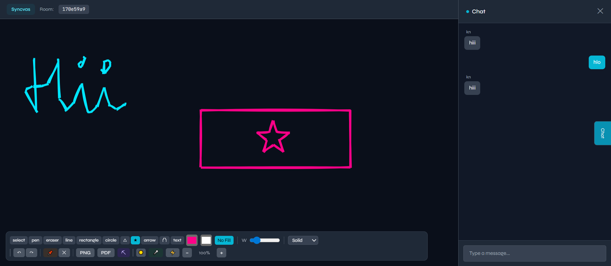

# Syncvas

> Where ideas sync in real time.

A real-time collaborative whiteboard built with React, Node.js, Socket.io, and Yjs.

## Features
- Multiplayer drawing canvas with 6 tools
- Draggable sticky notes synced across all users
- Live cursors with username labels
- Real-time chat panel
- CRDT-based offline sync (Yjs)
- Shareable room URLs
- Undo/Redo and PNG export

## 🛠️ Tech Stack

### Frontend
- React
- TypeScript
- Tailwind CSS
- Vite

### Backend
- Node.js
- Express.js
- Socket.IO

## 📸 Screenshots

### Dashboard UI


### Whiteboard Feature


## ⚙️ Installation

```bash
# Clone repository
git clone https://github.com/mansi0052/Syncvas.git

# Open project folder
cd Syncvas

# Install dependencies
npm install

# Start development server
npm run dev
