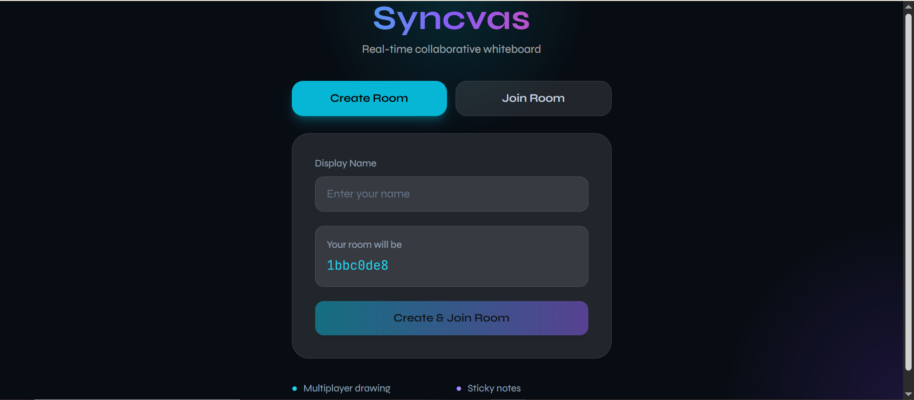
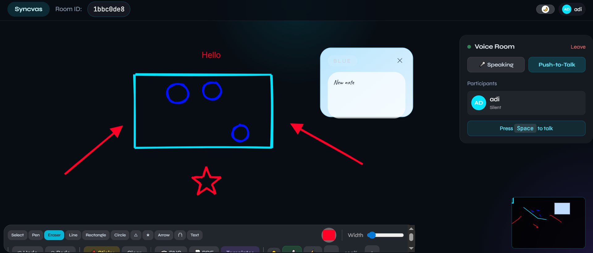

# Syncvas

> Where ideas sync in real time.

A real-time collaborative whiteboard built with React, Node.js, Socket.io, and Yjs.

## ✨ Features

- 🖊️ Freehand drawing with 10 tools (pen, eraser, lines, rectangles, circles, triangles, stars, arrows, polygons, text)
- 📌 Draggable sticky notes synced across all users
- 👤 Live cursors with username labels
- 💬 Real-time chat panel with typing indicators
- 🎤 Built-in voice room (push-to-talk or always-on mode)
- ↶ Undo / Redo with shared history
- 🔍 Pan, zoom, and minimap navigation
- 🔦 Laser pointer for presentations
- 📤 Export to PNG or PDF
- 🎨 Pre-built templates to kick-start a board
- 🌗 Dark & light theme
- ⚡ CRDT-based conflict-free real-time sync (Yjs)
- 🔗 Shareable room URLs

## 🛠️ Tech Stack

### Frontend
- React
- TypeScript
- Tailwind CSS
- Vite

### Backend
- Node.js
- Express.js
- Socket.IO

## 📸 Screenshots

### Dashboard UI


### Whiteboard Feature


## ⚙️ Installation

```bash
# Clone repository
git clone https://github.com/mansi0052/Syncvas.git

# Open project folder
cd Syncvas

# Install dependencies
npm install

# Start development server
npm run dev
```

Open http://localhost:5173

Deployed on vercel - 
🔗 ## 🌐 Live Demo

🔗 syncvas-client.vercel.app
